# 06 - 核心业务流程

> 本文聚焦"会跑起来"的关键业务链路：状态机、时序图、延迟调度、异常路径。  
> 所有流程图使用 Mermaid 语法，GitHub / 各大 IDE 默认支持渲染。

---

## 1. 概览

| 流程 | 涉及模块 | 关键风险 |
| :--- | :--- | :--- |
| 1. 微信登录 | user | Token 时效、session_key 泄漏 |
| 2. 实名认证 | user, risk | OCR 置信度、人工审核队列积压 |
| 3. 讲师入驻 | user, payment | 保证金支付、资格复核 |
| 4. 服务发布 | service, risk | "先发后审" 失控、违规内容 |
| 5. 下单支付 | order, payment | 库存超卖、重复扣款 |
| 6. 订单履约 | order, message | 超时推进、凭证完整性 |
| 7. 退款与仲裁 | order, payment, admin | 协商争议、多次退款 |
| 8. 评价与信誉 | review, user | 恶意差评、信誉炒作 |
| 9. 资金结算 | payment | T+1、对账差异 |

---

## 2. 订单状态机总图

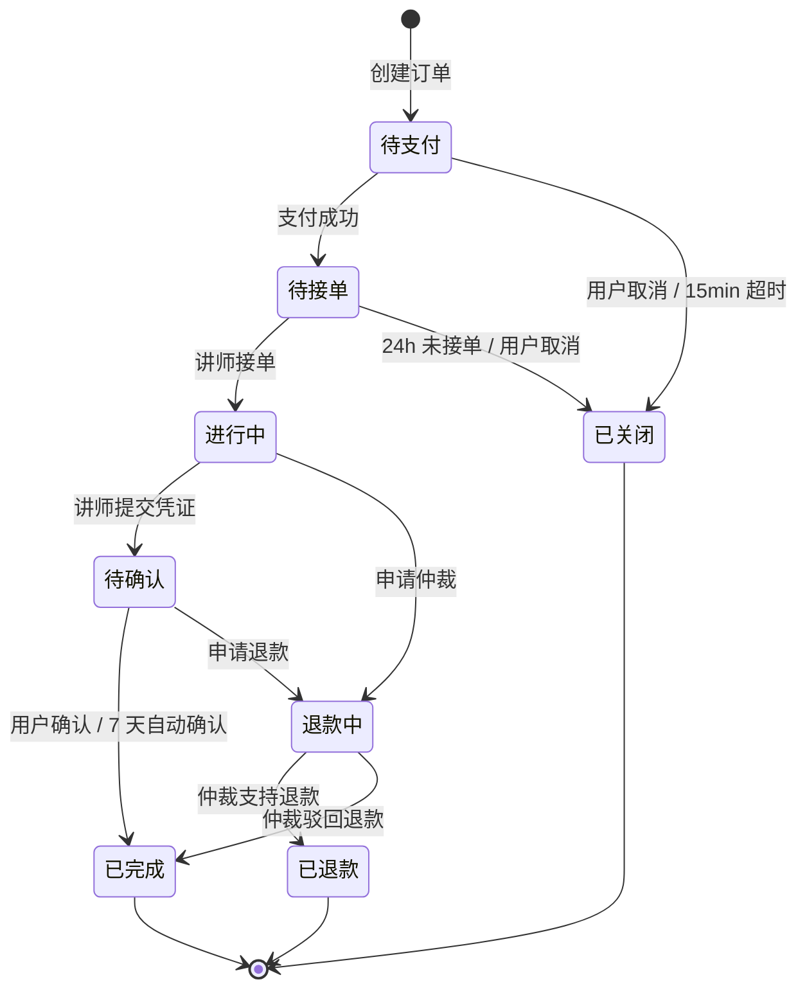

**状态值参考**：

| 值 | 常量 | 含义 |
| :-: | :--- | :--- |
| 10 | WAIT_PAY | 待支付 |
| 20 | WAIT_ACCEPT | 待接单 |
| 30 | IN_SERVICE | 进行中 |
| 40 | WAIT_CONFIRM | 待确认 |
| 50 | DONE | 已完成 |
| 60 | CLOSED | 已关闭 |
| 70 | REFUNDING | 退款中 |
| 80 | REFUNDED | 已退款 |

**合法流转矩阵**（源 → 目标）：

```
10 → 20, 60
20 → 30, 60
30 → 40, 70
40 → 50, 70
70 → 80, 50
```

---

## 3. 延迟队列与超时调度

### 3.1 Redis ZSet 延迟队列设计

```text
┌──────────────────────────────────────────────────────────┐
│  Redis ZSet 键名约定（按业务场景分离）                   │
├──────────────────────────────────────────────────────────┤
│  delay:order:pay:timeout         —— 15min 支付超时        │
│  delay:order:accept:timeout      —— 24h 接单超时          │
│  delay:order:auto-confirm        —— 7d 验收自动确认       │
│  delay:seller:settle             —— 24h 冻结转可用        │
│  delay:dispute:evidence          —— 48h 举证超时          │
└──────────────────────────────────────────────────────────┘

成员（member）：orderId 或 "orderId:bizKey"（便于幂等）
分值（score）：到期时间戳（毫秒）
```

### 3.2 扫描与消费

```text
┌─────────────────────────────────────────────────────────┐
│  @Scheduled(fixedDelay = 30_000)                        │
│  public void scan() {                                   │
│      Set<String> ready = delayQueue.pop(queue, 100);    │
│      for (id : ready) {                                 │
│          try { handler.handle(id); }                    │
│          catch (Exception e) {                          │
│              // 失败重试：重新 push 延迟 1 分钟            │
│              delayQueue.push(queue, id, Duration.ofMinutes(1)); │
│          }                                              │
│      }                                                  │
│  }                                                      │
└─────────────────────────────────────────────────────────┘
```

### 3.3 兜底：数据库扫描

Redis 宕机或任务丢失时，由定时任务扫描数据库兜底：

```sql
SELECT id FROM order_main
WHERE expire_time < NOW()
  AND status IN (10, 20, 40)
LIMIT 500;
```

执行周期：每 5 分钟一次。对命中订单执行与 Redis 消费相同的业务逻辑，保证最终一致。

---

## 4. 流程一：微信登录

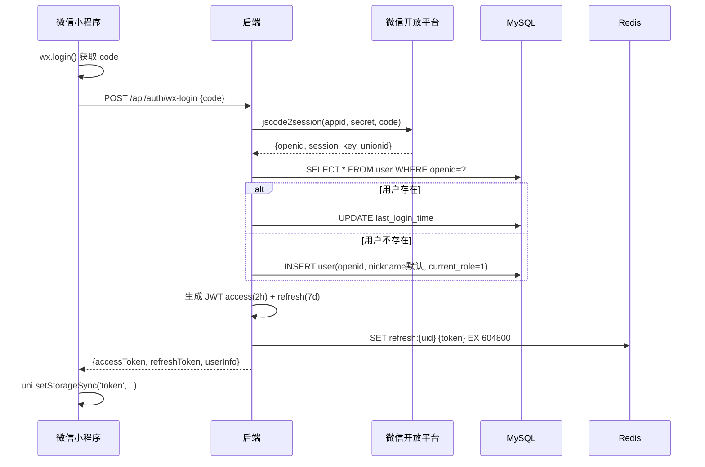

**异常处理**：

| 异常 | 处理 |
| :--- | :--- |
| `jscode2session` 40029 (code 无效) | 提示"登录已失效，请重试"；前端重新 `wx.login` |
| 微信接口超时（3s） | 返回 `90001`；前端重试 1 次 |
| 用户状态被封禁 | 返回 `10003`；前端引导至客服页 |

---

## 5. 流程二：实名认证

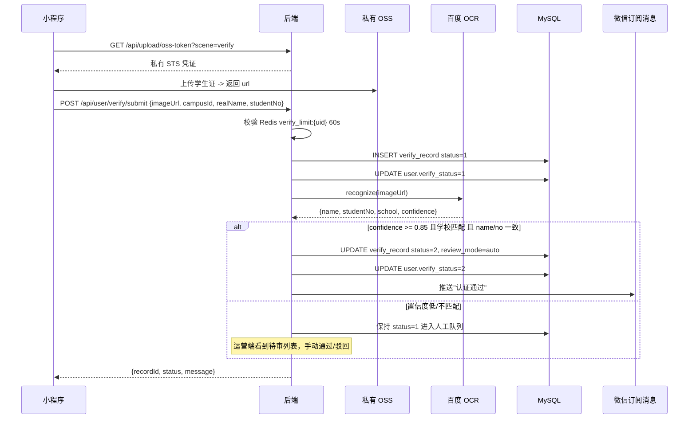

**人工审核**：运营同学在管理后台按记录逐条审核，点击"通过/驳回"。

---

## 6. 流程三：讲师入驻

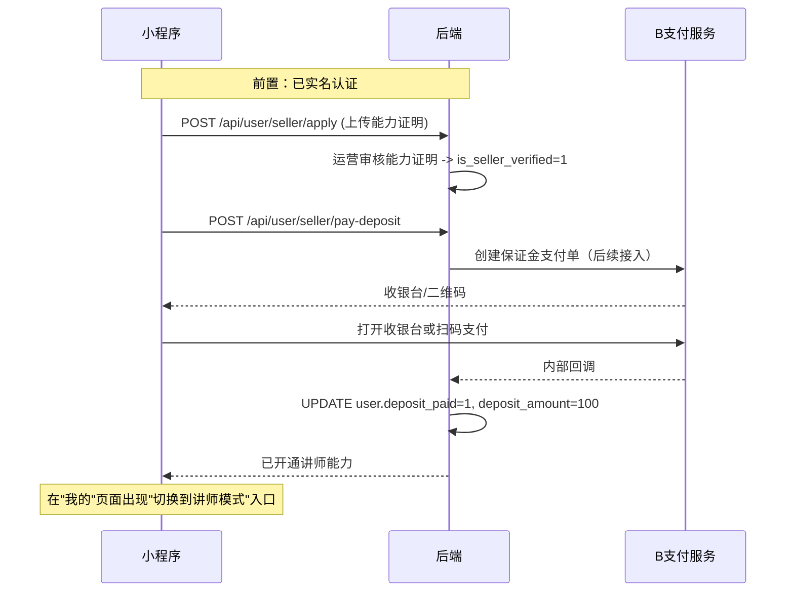

---

## 7. 流程四：服务发布（先发后审）

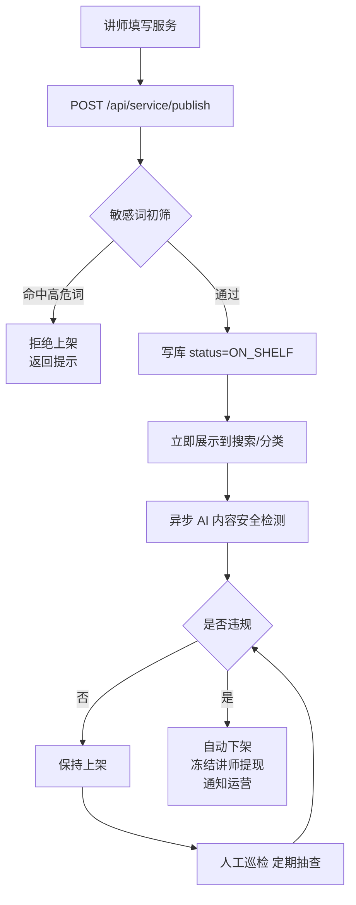

**核心 SOP**：

1. 前端提交前先本地过滤"微信/手机号/代写/保过"等关键词
2. 后端 DFA 过滤二次拦截
3. 上架成功后异步调用内容安全 API
4. 违规商品自动下架，并在 `risk_log` 记录，累计 3 次封号

---

## 8. 流程五：下单支付（核心路径）

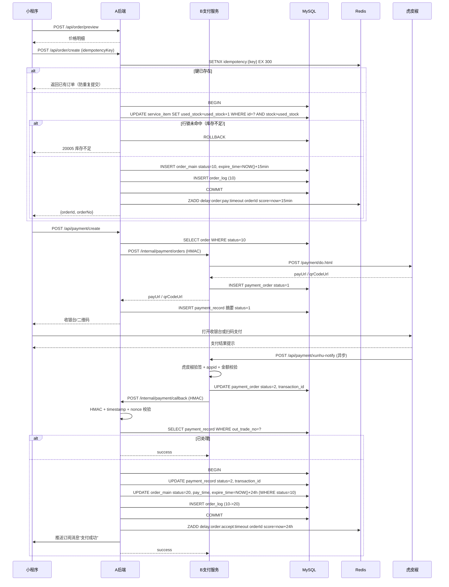

**关键保障**：

1. **幂等键**：客户端提交 `X-Idempotency-Key`（UUID），后端 Redis `SETNX` 存储 5 分钟，防重复提交
2. **库存扣减**：UPDATE 必须带 `WHERE stock > used_stock`，利用 InnoDB 行锁
3. **回调幂等**：B 的 `payment_order.trade_order_id` 与 A 的 `payment_record.out_trade_no` 均唯一，状态前置校验
4. **超时控制**：支付超时 15 分钟（释放库存）；接单超时 24 小时
5. **内部签名**：A/B 内部接口使用 `X-JJ-*` HMAC-SHA256，Redis nonce 防重放

---

## 9. 流程六：订单履约

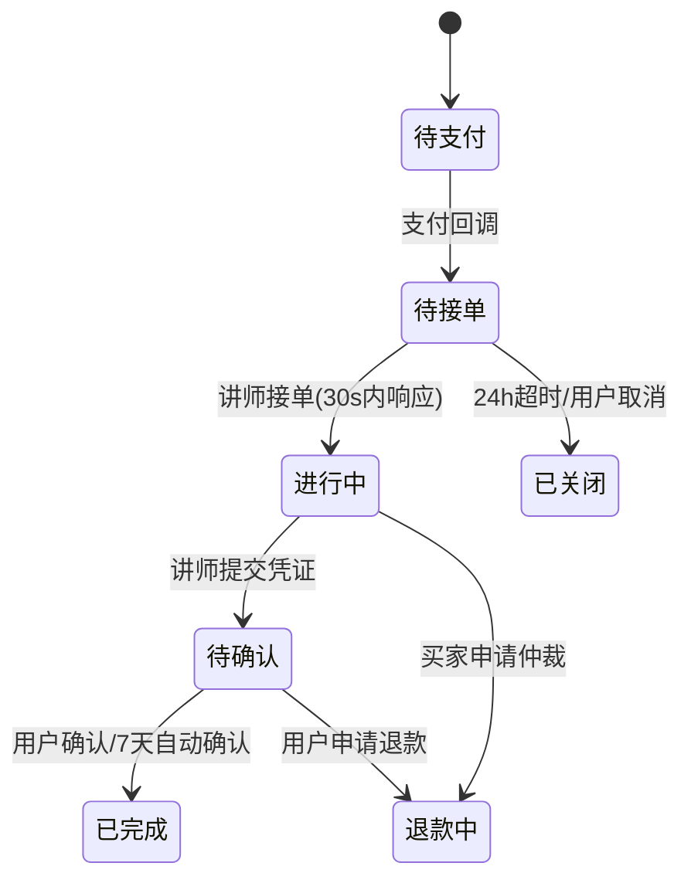

### 9.1 讲师接单

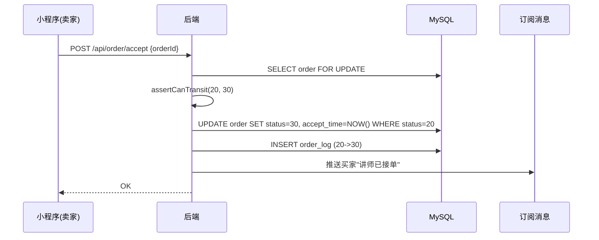

### 9.2 讲师交付

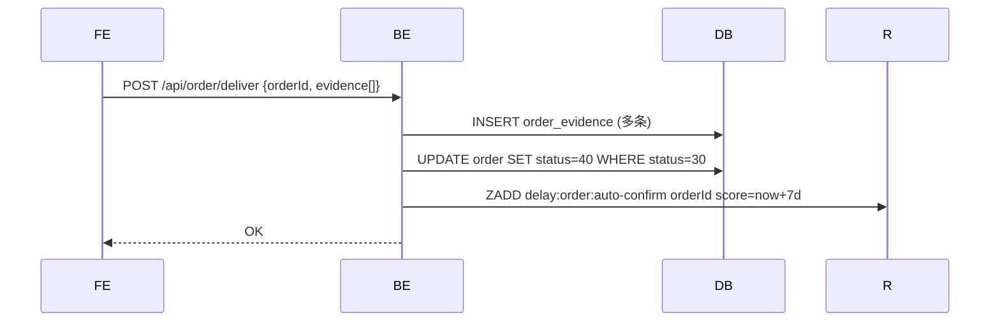

### 9.3 买家确认（或 7 天自动确认）

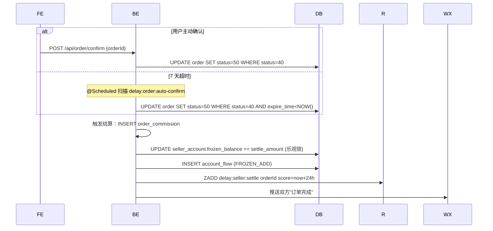

---

## 10. 流程七：退款与仲裁

### 10.1 退款类型

| 类型 | 触发 | 金额 | 备注 |
| :--- | :--- | :--- | :--- |
| 支付超时退款 | 15 分钟未支付 | 全额 | 自动，无需审核 |
| 接单超时退款 | 24 小时未接单 | 全额 | 自动，无需审核 |
| 买家协商退款 | 双方在订单内协商 | 部分/全额 | 无需平台介入 |
| 仲裁退款 | 买家申请，平台判定 | 平台决定 | 3 人仲裁团 |
| 管理员退款 | 违规/异常 | 全额 | 需操作审计 |

### 10.2 仲裁流程

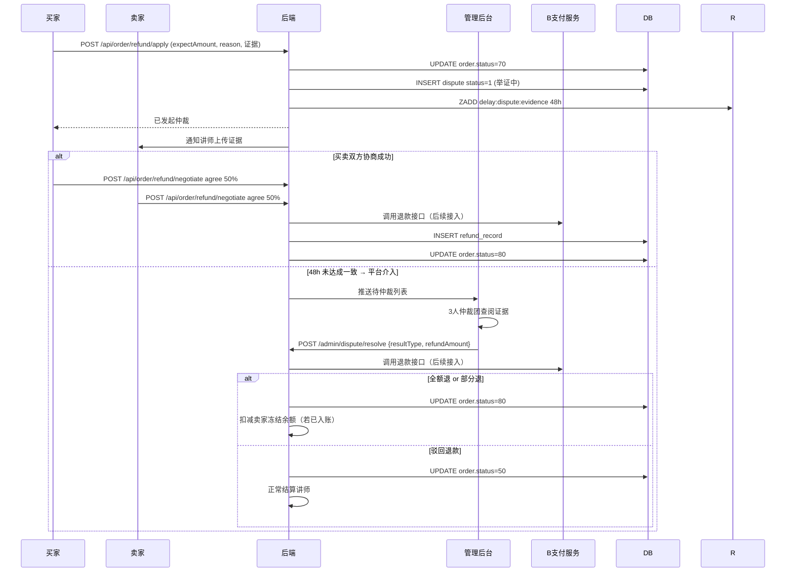

### 10.3 退款执行

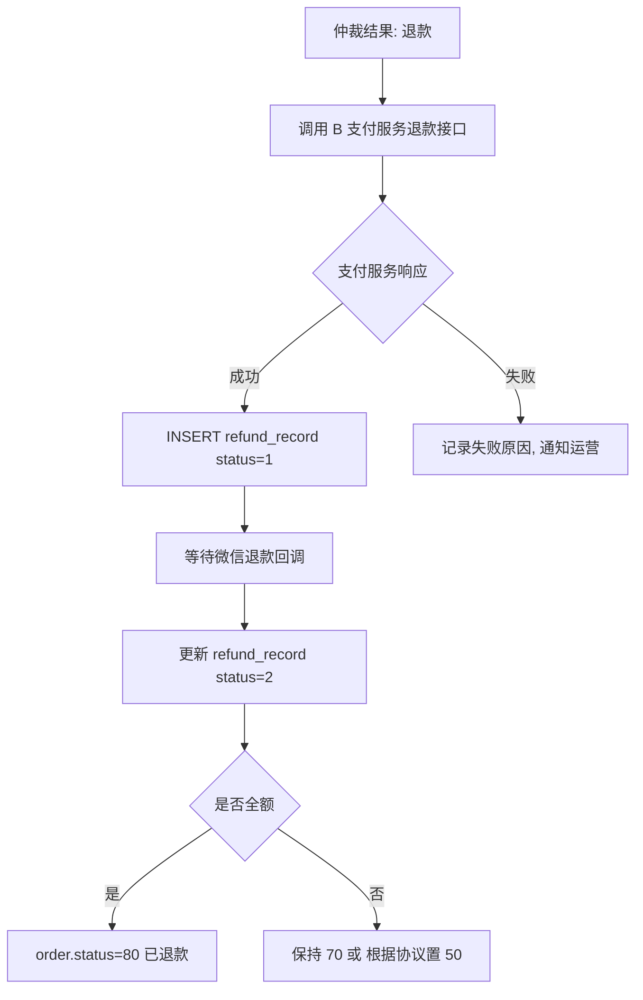

---

## 11. 流程八：评价与信誉

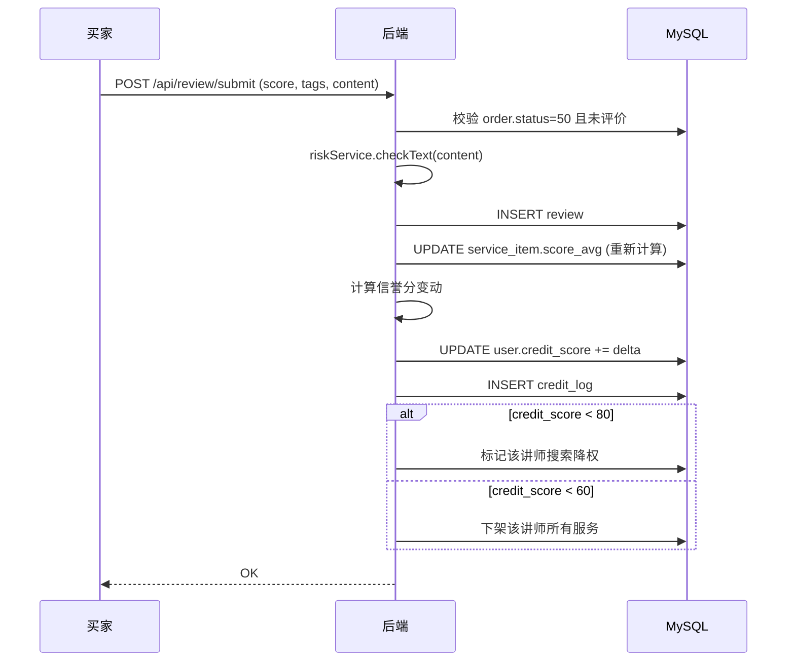

**信誉分算法**：

```java
int delta = switch (score) {
    case 5 -> +2;
    case 4 -> +1;
    case 3 ->  0;
    case 2 -> -3;
    case 1 -> -5;
    default -> 0;
};
if (disputeLose) delta -= 10;
if (timeoutCancel) delta -= 2;
```

| 阈值 | 效果 |
| :--- | :--- |
| ≥ 110 | "优质讲师" 徽章 |
| 80 ~ 109 | 正常 |
| 60 ~ 79 | 搜索降权 |
| < 60 | 禁止发布新服务，已上架服务下架 |

---

## 12. 流程九：资金结算

### 12.1 T+1 冻结转可用

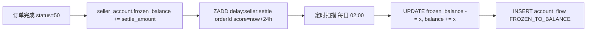

### 12.2 提现流程

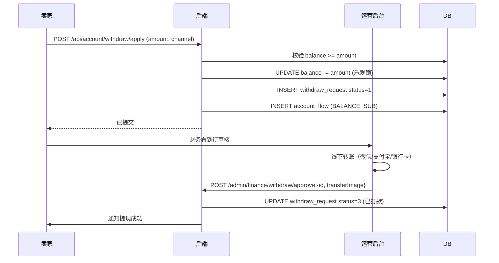

> V2.0 升级为微信"企业付款到零钱"自动到账。

---

## 13. 关键异常路径汇总

| 场景 | 处理 | 补偿方式 |
| :--- | :--- | :--- |
| 支付回调超时 | 微信会重试 6 次（最长 24h） | 幂等 + 对账定时任务 |
| 退款接口失败 | `refund_record.status=3`，运营介入 | 人工重试，每日对账 |
| OCR 服务不可用 | 转人工审核队列 | 运营手工处理 |
| Redis 宕机 | 延迟任务丢失 | DB `expire_time` 兜底扫描 |
| MySQL 主从延迟 | 写后读不一致 | 关键路径强制读主 |
| 订单状态并发 | 两个请求同时更新 | UPDATE 带 `WHERE status=from` |

---

## 14. 幂等性设计汇总

| 场景 | 幂等键 | 机制 |
| :--- | :--- | :--- |
| 用户下单 | `X-Idempotency-Key`（UUID） | Redis SETNX 5min |
| 支付回调 | `out_trade_no` | DB 唯一索引 + 状态校验 |
| 退款调用 | `refund_no` | DB 唯一索引 + 状态校验 |
| 接单/确认 | `orderId + targetStatus` | UPDATE 带 `WHERE status=from` |
| 提现申请 | `withdraw_no` | DB 唯一索引 |
| 评价提交 | `orderId + reviewType` | DB `uk_order_reviewer` |

---

## 15. 性能关键路径

| 路径 | 目标延迟 | 关键优化 |
| :--- | :--- | :--- |
| 首页/搜索 | < 300ms | Redis 缓存 10min + MySQL FULLTEXT |
| 下单创建 | < 500ms | 事务短小；仅一条 UPDATE 扣库存 |
| 支付回调 | < 500ms | 异步推送通知（不阻塞回调） |
| 订单列表 | < 300ms | `idx_buyer_status` 覆盖索引 |

---

## 下一步

- [07-安全与风控设计](./07-安全与风控设计.md)：了解各环节的安全约束
- [08-部署与运维](./08-部署与运维.md)：了解环境如何承载这些流程
