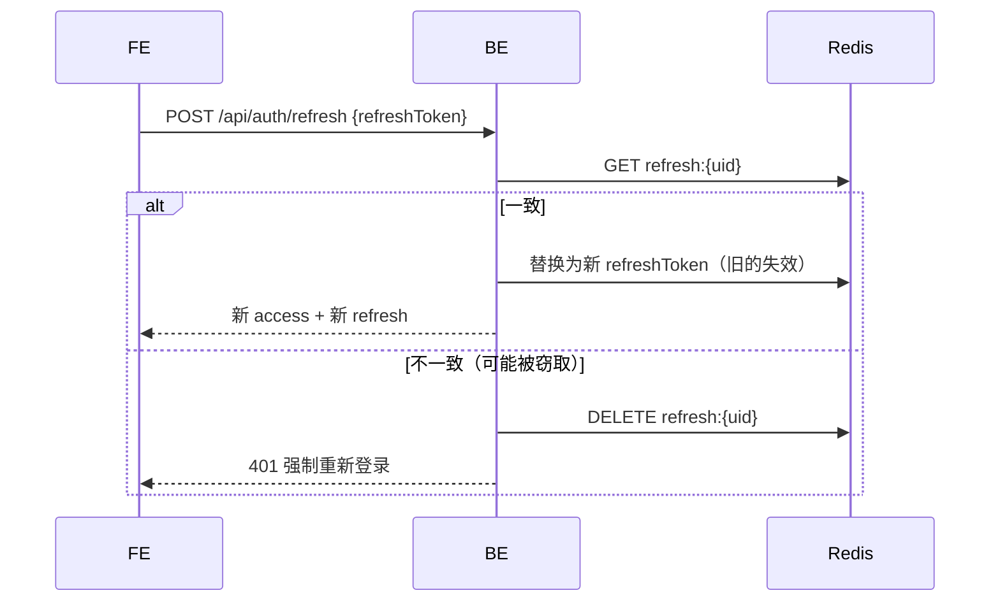

# 07 - 安全与风控设计

> 安全是 C2C 平台的生命线。本文覆盖 **鉴权、数据安全、支付安全、内容安全、防刷风控、合规** 六大维度，每条策略给出落地点与关键参数。

---

## 1. 安全整体模型

```text
┌───────────────────────────────────────────────────────────┐
│             纵深防御（Defense in Depth）                   │
├───────────────────────────────────────────────────────────┤
│  L1 网络层 : HTTPS + WAF + CDN + DDoS 基础防护             │
│  L2 接入层 : Nginx 限流 + IP 黑白名单                      │
│  L3 应用层 : JWT 鉴权 + RBAC + 方法级 @PreAuth             │
│  L4 业务层 : 状态机、幂等、参数校验、防超卖                 │
│  L5 数据层 : 字段加密、最小权限、脱敏展示                   │
│  L6 合规层 : 三重审核（AI + 人工 + 举报）+ 操作审计         │
└───────────────────────────────────────────────────────────┘
```

---

## 2. 鉴权与授权

### 2.1 JWT Token 设计

| 项 | access_token | refresh_token |
| :--- | :--- | :--- |
| 算法 | HS256（V1）/ RS256（V2+） | 同左 |
| 有效期 | 2 小时 | 7 天 |
| Claims | `uid`、`role`、`campusId`、`exp`、`iat`、`jti` | `uid`、`exp`、`jti` |
| 存储 | 客户端 Storage；服务端不存（无状态） | 服务端 Redis 存最新一个（单点登录） |
| 下发位置 | Response Body | Response Body |

**关键实现**：

```java
public String generate(Long userId, Integer role, Long campusId, Duration ttl) {
    Date exp = Date.from(Instant.now().plus(ttl));
    return Jwts.builder()
            .setSubject(String.valueOf(userId))
            .claim("uid", userId)
            .claim("role", role)
            .claim("campusId", campusId)
            .claim("jti", UUID.randomUUID().toString())
            .setIssuedAt(new Date())
            .setExpiration(exp)
            .signWith(secretKey, SignatureAlgorithm.HS256)
            .compact();
}
```

### 2.2 Refresh Token 轮换



### 2.3 RBAC 角色

| 角色 Code | 名称 | 可访问接口前缀 |
| :--- | :--- | :--- |
| `ROLE_USER` | 普通用户（买家） | `/api/user/**`、`/api/order/buyer/**`、`/api/service/public/**` |
| `ROLE_SELLER` | 讲师（卖家） | 额外：`/api/service/publish`、`/api/order/seller/**`、`/api/account/**` |
| `ROLE_ADMIN` | 平台管理员 | `/admin/**` |
| `ROLE_OPS` | 运营（仅后台部分权限） | `/admin/verify/**`、`/admin/dispute/**` |
| `ROLE_FINANCE` | 财务（仅提现、对账） | `/admin/finance/**` |

### 2.4 方法级权限注解

```java
// 普通买家访问
@PreAuth
@GetMapping("/list")
public Result<?> list() { ... }

// 已认证讲师才能发布
@PreAuth(role = "ROLE_SELLER", requireVerify = true, requireDeposit = true)
@PostMapping("/publish")
public Result<?> publish(...) { ... }

// 管理员
@PreAuth(role = "ROLE_ADMIN")
@PostMapping("/ban")
public Result<?> ban(...) { ... }
```

### 2.5 数据行级权限

**场景**：讲师 A 不能修改讲师 B 的服务。

```java
@Service
public class ServiceItemServiceImpl {
    public void update(Long id, UpdateDTO dto, UserContext ctx) {
        ServiceItem item = mapper.selectById(id);
        if (item == null) throw new BusinessException(ErrorCode.NOT_FOUND);
        if (!Objects.equals(item.getSellerId(), ctx.getUserId())) {
            throw new BusinessException(ErrorCode.NO_PERMISSION, "无权操作该服务");
        }
        ...
    }
}
```

**场景**：买家 A 只能看自己的订单。

所有订单列表 SQL 强制拼接 `WHERE buyer_id = #{uid}` 或 `seller_id = #{uid}`。

---

## 3. 数据安全

### 3.1 字段级加密

| 字段 | 算法 | 密钥管理 | 展示方式 |
| :--- | :--- | :--- | :--- |
| 手机号 | AES-256-CBC | KMS / 配置中心 | `138****1234` |
| 真实姓名 | AES-256-CBC | 同上 | 仅后台审核可见 |
| 学号 | AES-256-CBC | 同上 | 不对外展示 |
| 密码 | **不存储**（微信登录） | - | - |
| 银行卡/支付宝账号 | AES-256-CBC | 同上 | `**** **** 1234` |

**加密工具类**：

```java
@Component
public class AesCryptoUtil {

    @Value("${jijiang.crypto.aes-key}")
    private String aesKey;

    public String encrypt(String plain) {
        if (plain == null) return null;
        byte[] iv = new byte[16];
        SecureRandom.getInstanceStrong().nextBytes(iv);
        Cipher cipher = Cipher.getInstance("AES/CBC/PKCS5Padding");
        cipher.init(Cipher.ENCRYPT_MODE, new SecretKeySpec(aesKey.getBytes(), "AES"), new IvParameterSpec(iv));
        byte[] encrypted = cipher.doFinal(plain.getBytes(StandardCharsets.UTF_8));
        return Base64.getEncoder().encodeToString(iv) + ":" + Base64.getEncoder().encodeToString(encrypted);
    }

    public String decrypt(String cipherText) {
        String[] parts = cipherText.split(":");
        byte[] iv = Base64.getDecoder().decode(parts[0]);
        byte[] encrypted = Base64.getDecoder().decode(parts[1]);
        Cipher cipher = Cipher.getInstance("AES/CBC/PKCS5Padding");
        cipher.init(Cipher.DECRYPT_MODE, new SecretKeySpec(aesKey.getBytes(), "AES"), new IvParameterSpec(iv));
        return new String(cipher.doFinal(encrypted), StandardCharsets.UTF_8);
    }
}
```

### 3.2 脱敏展示

所有返回前端的 VO 必须经过 DesensitizeUtil 处理：

```java
public static String maskPhone(String phone) {
    if (StringUtils.isBlank(phone) || phone.length() != 11) return phone;
    return phone.substring(0, 3) + "****" + phone.substring(7);
}

public static String maskName(String name) {
    if (name == null || name.isBlank()) return name;
    if (name.length() == 2) return name.charAt(0) + "*";
    return name.charAt(0) + "*".repeat(name.length() - 2) + name.charAt(name.length() - 1);
}
```

MyBatis 层可用 `TypeHandler` 实现写入自动加密：

```java
@MappedTypes(String.class)
public class EncryptedStringTypeHandler extends BaseTypeHandler<String> {
    @Override
    public void setNonNullParameter(PreparedStatement ps, int i, String plain, JdbcType jdbcType) {
        ps.setString(i, AesCryptoUtil.INSTANCE.encrypt(plain));
    }
    @Override
    public String getNullableResult(ResultSet rs, String columnName) {
        return AesCryptoUtil.INSTANCE.decrypt(rs.getString(columnName));
    }
}
```

### 3.3 私有 OSS 与临时 URL

```text
公开 Bucket（jijiang-public）
  ├─ cover/            服务封面
  ├─ avatar/           用户头像
  └─ banner/           运营 Banner

私有 Bucket（jijiang-private）
  ├─ verify/           实名证件图片 ← 读取需临时签名 URL（5 min）
  ├─ evidence/         交付凭证    ← 订单双方可见
  ├─ dispute/          仲裁证据
  └─ withdraw/         打款凭证（运营）
```

**生成临时签名 URL**：

```java
public String signedUrl(String path, Duration ttl) {
    Date expiration = Date.from(Instant.now().plus(ttl));
    return ossClient.generatePresignedUrl("jijiang-private", path, expiration).toString();
}
```

客户端获取时调用 `/api/upload/signed-url?path=xxx`，**永远不要把私有路径直接拼接域名返回**。

### 3.4 密钥管理

| 密钥 | 存储位置 | 轮换周期 |
| :--- | :--- | :--- |
| JWT secret | 环境变量 / 配置中心 | 半年 |
| AES 字段加密密钥 | KMS / 配置中心（禁止写 Git） | 一年 |
| 虎皮椒 appsecret | 仅 B 支付服务环境变量 / 配置中心 | 按支付平台要求 |
| A/B 内部 HMAC 密钥 | A、B 环境变量 / 配置中心 | 半年 |
| OSS AK/SK | RAM 子账号，最小权限 | 半年 |
| 数据库密码 | 环境变量，不进 `application.yml` | 按需 |

**硬约束**：
- 任何密钥不得 `git commit`；使用 `.env` + `.gitignore`
- 生产密钥与开发密钥物理隔离
- 定期检查 Git 历史是否误提交（pre-commit hook）

### 3.5 账号注销（PIPL 合规）

| 阶段 | 操作 | 依据 |
| :--- | :--- | :--- |
| 申请前 | 校验无未完结订单、无未提现余额、无封禁 | - |
| 冷静期（7 天） | 账号冻结但可撤销 | GDPR/PIPL 建议 |
| 冷静期结束 | 硬删除：openid、unionid、phone、real_name、student_no | 个人信息保护法 |
| 保留 | 订单流水、评价（改为"已注销用户"） | 审计、公平展示 |

---

## 4. 支付安全

### 4.1 支付服务边界

真实支付拆分为 A 主后端与 B 支付服务：

1. A 不保存虎皮椒 `appid/appsecret`，不直接调用虎皮椒，也不接收虎皮椒回调。
2. B 保存虎皮椒密钥、真实支付流水和虎皮椒原始回调报文。
3. B 完成虎皮椒 MD5 验签、`appid` 校验、金额校验后，使用内部 HMAC 回调 A。

### 4.2 A/B 内部签名与防重放

A→B、B→A 均使用 `X-JJ-*` 请求头：

```text
X-JJ-Client-Id
X-JJ-Timestamp
X-JJ-Nonce
X-JJ-Signature
```

签名串为：

```text
timestamp + "\n" + nonce + "\n" + method + "\n" + path + "\n" + sha256(body)
```

接收方必须校验 5 分钟时间窗，并用 Redis `SETNX internal:pay:nonce:{clientId}:{nonce}` 防重放。

### 4.3 金额安全

- **所有金额使用 `BigDecimal`**，禁止 `double`/`float`
- **存库以元为单位 `DECIMAL(10,2)`**；传给虎皮椒时保留两位小数
- **幂等校验**：B 的 `payment_order.trade_order_id` 与 A 的 `payment_record.out_trade_no` 均唯一
- **对账**：每日从 B 的真实支付流水与 A 的订单摘要比对（差异告警）

### 4.4 退款防滥用

| 限制 | 策略 |
| :--- | :--- |
| 累计退款 ≤ 已支付金额 | DB 计算 `SUM(refund_record.refund_amount)` |
| 一笔订单退款次数 ≤ 10 次 | DB 统计 |
| 管理员退款需二次确认 | 前端弹窗 + 操作员密码 |
| 退款金额范围 | 1 分 ~ 订单金额 |
| 重复退款请求 | 唯一键 `refund_no` 拒绝 |

### 4.5 提现防欺诈

- 日提现次数 ≤ 3
- 单笔提现金额 ≤ 5000（可配置）
- 余额变更必须有资金流水记录，两边 Sum 一致（每日对账）
- 人工审核 + 转账凭证截图上传
- 收款账号变更需二次认证（短信/微信）

---

## 5. 内容安全

### 5.1 三重审核机制

```text
                   ┌─ 用户输入（发布/聊天/评价）
                   │
                   ▼
            ┌──────────────┐
            │ L1 本地正则   │  ← 客户端提前拦截（防误操作）
            └──────┬───────┘
                   │
            ┌──────▼───────┐
            │ L2 DFA敏感词  │  ← 后端强制（绕不过）
            └──────┬───────┘
                   │
            ┌──────▼───────┐
            │ L3 AI内容审核 │  ← 百度/阿里云 异步/实时
            └──────┬───────┘
                   │
            ┌──────▼───────┐
            │ L4 人工巡检   │  ← 运营每日抽查
            └──────┬───────┘
                   │
            ┌──────▼───────┐
            │ L5 用户举报   │  ← 群众监督
            └──────────────┘
```

### 5.2 敏感词分类与动作

| 分类 | 示例 | 命中动作 |
| :--- | :--- | :--- |
| 代写代考 | 代写、代考、答案、包过、替考 | 拒绝上架，记风控日志 |
| 联系方式 | 微信、wx、QQ、手机号、+微信号 | 站内信拦截；发布时警告 |
| 违禁违规 | 涉政、涉黄、博彩 | 拒绝 + 上报 + 封号 |
| 其他违规 | 广告、辱骂 | 警告或下架 |

### 5.3 防跳单"联系方式"正则

```java
public static final Pattern CONTACT_PATTERN = Pattern.compile(
    "(微信|vx|wx|v\\s*x|QQ|q\\s*q|电话|手机)" +     // 文字关键词
    "|" +
    "\\b1[3-9]\\d{9}\\b" +                          // 手机号
    "|" +
    "\\b\\d{5,11}\\b" +                             // 5~11 位数字串（可能是 QQ）
    "|" +
    "(加我|私聊|线下|脱离平台|私下)"
);
```

在站内信发送时应用：

```java
if (CONTACT_PATTERN.matcher(content).find()) {
    throw new BusinessException(ErrorCode.CONTACT_FORBIDDEN, "请勿交换联系方式");
}
```

### 5.4 AI 内容安全接入

推荐：**阿里云 内容安全 · 文本** 或 **百度内容审核**。

```java
@Component
public class ContentSafetyClient {
    public ContentCheckResult check(String content) {
        // 调用阿里云 green service
        // 返回 category: pass | spam | ad | politics | porn | abuse
    }
}
```

**V1.0 策略**：文本发布时同步调用，延迟 ≤ 300ms；超时降级为"放行 + 异步复查"。

### 5.5 图片审核

| 场景 | 策略 |
| :--- | :--- |
| 实名证件 | 必须经过 OCR + 运营人工审核 |
| 服务封面 | 上传后异步 AI 图片审核；违规下架 |
| 聊天图片 | V1.0 不支持；V2.0 引入后必须实时审核 |

---

## 6. 风控与防刷

### 6.1 接口限流策略

使用 Redis 滑动窗口或令牌桶，基于 `ip + userId` 限流。

| 接口 | 限制 | 触发后 |
| :--- | :--- | :--- |
| `POST /api/auth/wx-login` | IP 60/min | HTTP 429 |
| `POST /api/user/verify/submit` | uid 1/60s | 业务错 70001 |
| `POST /api/order/create` | uid 10/min | 业务错 70001 |
| `POST /api/message/send` | uid 30/min | 业务错 70001 |
| `POST /api/review/submit` | uid 5/min | 业务错 70001 |
| `GET /api/service/search` | uid 100/min | 软限流，返回缓存 |

```java
public boolean allow(String key, int limit, Duration window) {
    long count = redisHelper.incrAndGet(key, window);
    return count <= limit;
}
```

### 6.2 防薅羊毛

| 场景 | 防护 |
| :--- | :--- |
| 新用户红包 | 同设备（UDID/IP/openid）只发一次 |
| 邀请奖励 | 被邀请者需完成实名 + 1 笔真实交易才发奖 |
| 优惠券 | 每人限领 N 次；标记 risk_log |
| 刷评 / 刷单 | 同 IP / 同设备 多次下单同讲师 → 人工复核 |

### 6.3 异常行为识别

```java
// 示例：短时间内大量下单后退款
public void detectRefundAbuse(Long userId) {
    long count = refundMapper.countByBuyerInLastDays(userId, 7);
    if (count >= 5) {
        riskLogMapper.insert(RiskLog.of(userId, "refund_abuse", ...));
        userService.restrictUser(userId, "频繁退款，限制下单", Duration.ofDays(7));
    }
}
```

### 6.4 验证码（V2 引入）

- 登录异常场景弹图形验证码
- 提现时弹短信验证码
- 大额交易弹人脸识别（V3）

---

## 7. 前端安全

### 7.1 小程序侧

- **Token 存储**：`uni.setStorageSync`；不打印到日志
- **敏感信息**：不在页面参数（`?phone=xxx`）中明文传递
- **调试开关**：生产环境禁用 `console.log`（Vite 插件自动剥离）
- **域名白名单**：小程序管理后台配置 `request 合法域名` 仅填后端域名
- **升级引导**：后端返回 `versionSupport` 字段，过老版本强制升级
- **水印**：敏感页面（如仲裁证据查看）叠加用户水印，防截图外传

### 7.2 管理后台（Web）

- **CSRF**：所有写接口需 CSRF Token（V2 起）
- **XSS**：富文本入库前 HTML Sanitize（Jsoup）
- **登录**：账密 + TOTP（Google Authenticator）
- **二次密码**：财务、仲裁、封号等高敏操作需二次输入密码
- **会话**：30min 无操作自动登出
- **IP 白名单**：财务/管理员账号仅允许指定 IP 登录

---

## 8. 日志与审计

### 8.1 操作审计

任何"人工操作"必须进 `operation_log`：

| 模块 | 动作 |
| :--- | :--- |
| 用户 | 封号、解封、注销 |
| 认证 | 通过、驳回 |
| 服务 | 强制下架 |
| 订单 | 退款、协商退款 |
| 仲裁 | 判决 |
| 财务 | 提现审核、打款、佣金率调整 |
| 风控 | 敏感词新增、举报处理 |

```java
@Aspect
@Component
public class AuditLogAspect {

    @AfterReturning("@annotation(audit)")
    public void recordAudit(JoinPoint jp, Audit audit) {
        OperationLog log = new OperationLog();
        log.setOperatorId(UserContextHolder.get().getUserId());
        log.setModule(audit.module());
        log.setAction(audit.action());
        log.setDetail(JSON.toJSONString(jp.getArgs()));
        log.setIp(IpUtil.getIp());
        operationLogMapper.insert(log);
    }
}
```

### 8.2 安全日志

单独记录：
- 登录失败 ≥ 5 次 → 告警
- Token 解析失败 / 异常 IP → 告警
- 高敏接口（提现、退款、封号）每次必记

### 8.3 日志脱敏

日志打印前必须脱敏：

```java
log.info("user phone {}", DesensitizeUtil.maskPhone(phone));
```

---

## 9. 合规策略

### 9.1 合规红线（P0）

| 红线 | 措施 |
| :--- | :--- |
| 代写代考 | 敏感词三重拦截；发现即下架 + 封号 |
| 传播违禁品 | AI + 人工；0 容忍 |
| 卖家卷款 | 担保交易 + T+1 + 保证金 100 元 |
| 资金池违规 | V1.0 单校月流水 ≤ 10 万；超则升级微信支付收付通 |
| 用户信息泄露 | 字段加密 + 私有 OSS + 最小权限 |

### 9.2 合规文档

用户首次使用须同意：

| 文档 | 内容要点 |
| :--- | :--- |
| 《技匠用户协议》 | 平台为信息中介；禁止代写代考 |
| 《隐私政策》 | 收集字段、用途、保存期限、注销方式 |
| 《合规公约》 | 禁止行为清单、处罚措施 |
| 《讲师服务协议》（讲师额外签） | 服务范围、违约处罚、免责 |

### 9.3 校方备案

- 主动向校团委、创新创业中心备案
- 申请"大学生创新创业实践基地"
- 保留备案函扫描件，放在管理后台可随时调阅

### 9.4 数据存储合规

- 境内服务器（阿里云/腾讯云国内区域）
- 用户数据不出境
- 个人信息收集最小化原则（只收业务必须字段）
- 定期做 PIPL 自评估

---

## 10. 应急响应

### 10.1 事件分级

| 级别 | 定义 | 响应时间 |
| :--- | :--- | :--- |
| P0 | 支付故障、大规模资损 | ≤ 10 min |
| P1 | 核心服务不可用（登录/下单） | ≤ 30 min |
| P2 | 单功能异常 | ≤ 4 h |
| P3 | 体验问题 | ≤ 24 h |

### 10.2 应急 SOP

```text
1. 发现/告警 → 值班同学确认
2. 拉群（P0 立即；P1 10 分钟内）
3. 止损优先：
   - 支付异常 → 关闭下单入口（配置开关）
   - DB 异常  → 切从库只读
   - 接口打爆 → 限流、降级
4. 根因分析 → 修复
5. 复盘 → 录入 ADR 与 Runbook
```

### 10.3 Kill Switch（开关）

在配置中心或数据库设置运行时开关：

| 开关 | 作用 |
| :--- | :--- |
| `global.order.create.enabled` | 关闭全站下单 |
| `global.withdraw.enabled` | 关闭提现（仅财务异常时） |
| `global.register.enabled` | 关闭新用户注册 |
| `global.message.send.enabled` | 关闭站内信 |

触发方式：运营后台按钮；或 DB 直改；30 秒内全应用生效。

---

## 11. 安全自查清单（上线前必查）

- [ ] 所有对外接口加 HTTPS
- [ ] JWT 密钥非默认值，非弱密码
- [ ] `application.yml` 中无明文密码
- [ ] 实名证件、身份证图片存私有 Bucket
- [ ] 手机号、真实姓名字段加密存储
- [ ] 支付回调有验签 + 幂等
- [ ] 所有 SQL 使用参数化（MyBatis `#{}`，禁用 `${}` 拼接）
- [ ] 所有用户输入经过校验
- [ ] 禁用 `SELECT *`；分页参数有最大值
- [ ] 跨域配置只允许指定前端域名
- [ ] 日志不打印 Token、密码、密钥
- [ ] 生产环境关闭 Knife4j 入口 或 加登录校验
- [ ] 管理后台禁止未授权访问；IP 白名单
- [ ] 错误响应不泄漏堆栈信息
- [ ] 定时任务执行权限最小化
- [ ] OSS Bucket 权限：私有为默认
- [ ] Redis 生产密码强度足够
- [ ] MySQL 只开内网端口；root 账号仅本地
- [ ] 开启 slow_query_log、binlog、审计日志
- [ ] 备份：MySQL 每日全备 + binlog 增量；保留 30 天

---

## 下一步

- 阅读 [08-部署与运维](./08-部署与运维.md) 了解如何落地这些安全措施
- 阅读 [09-开发规范](./09-开发规范.md) 了解代码层的安全约束
